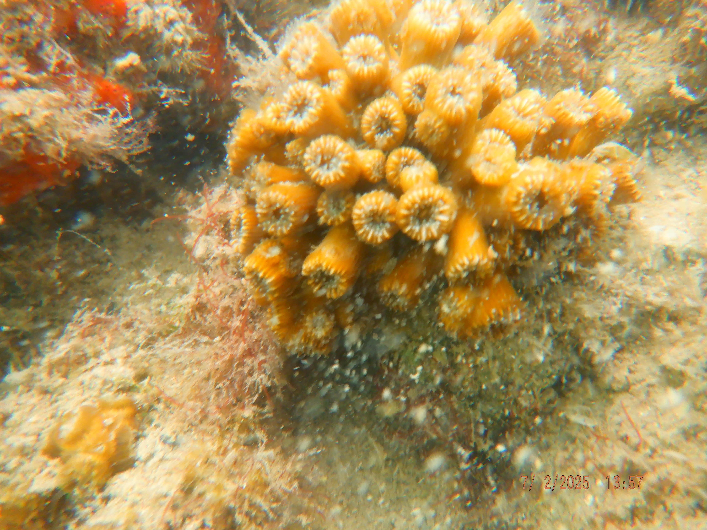
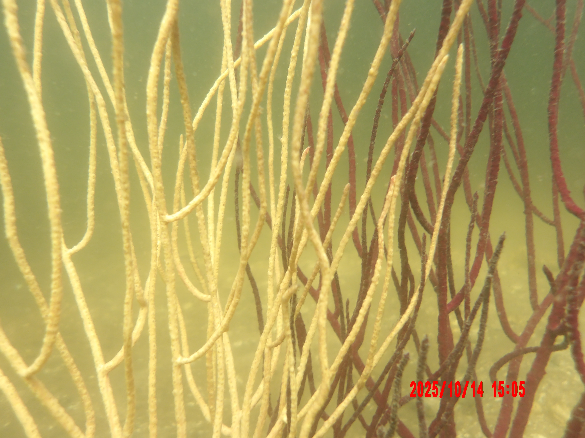
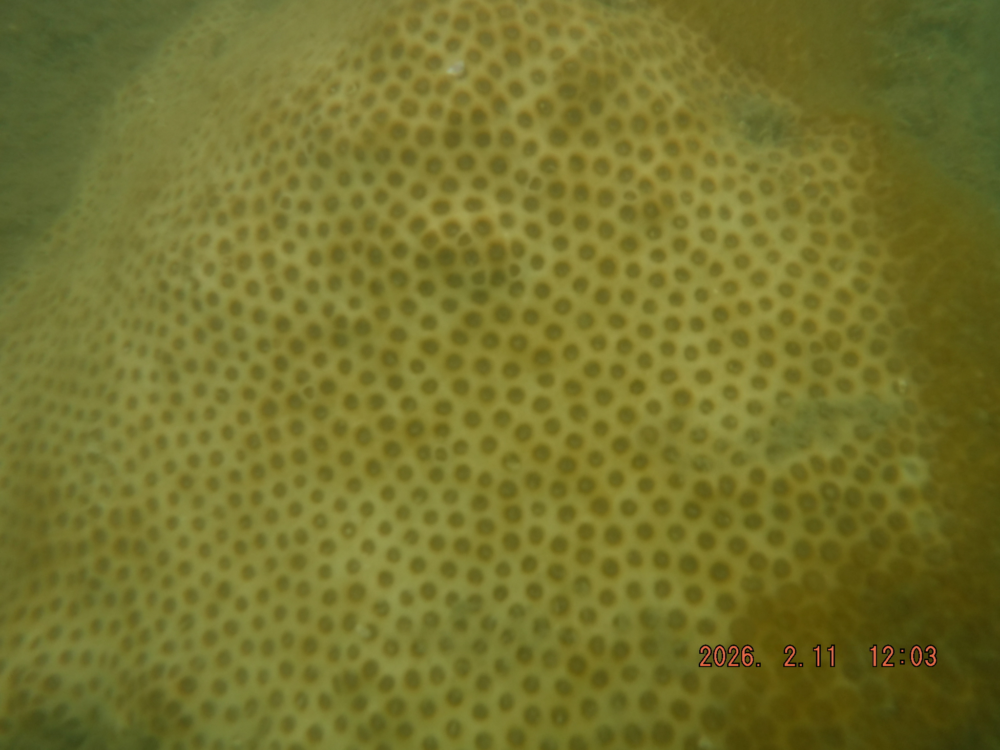
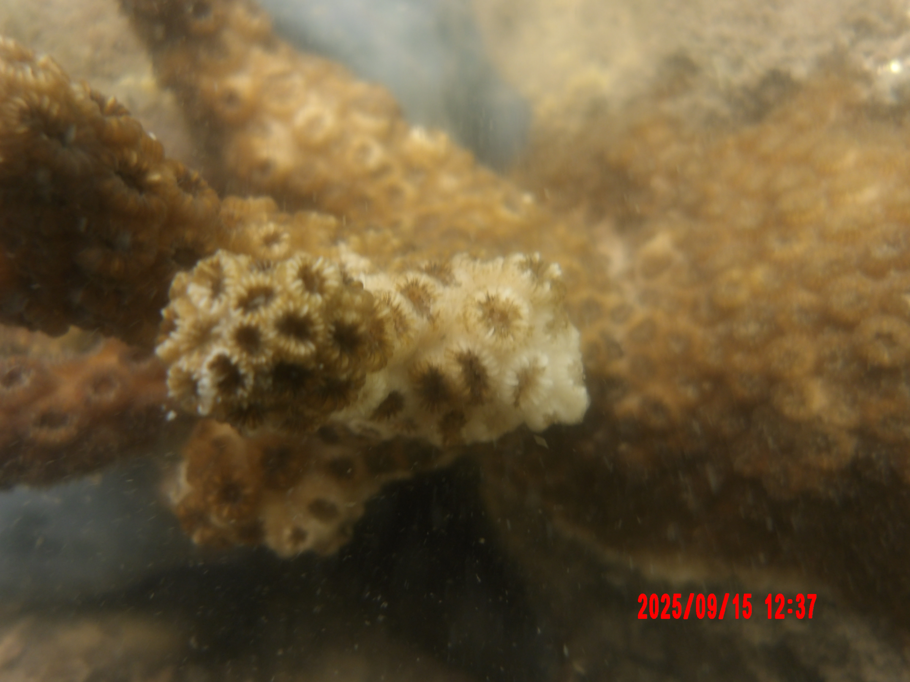
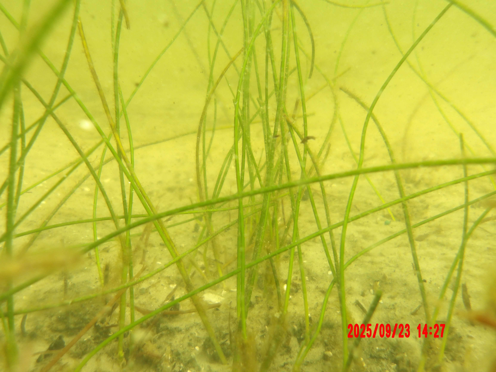
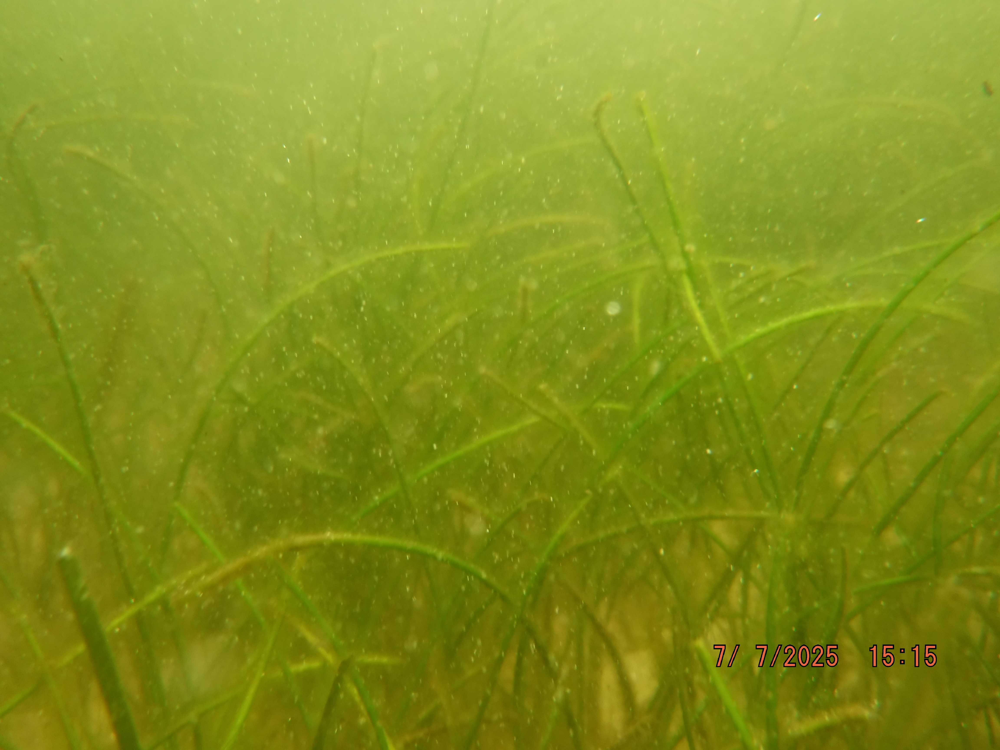
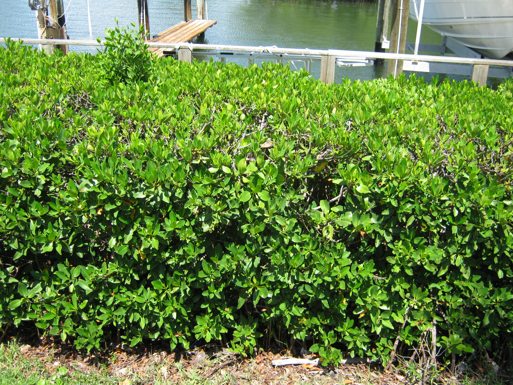
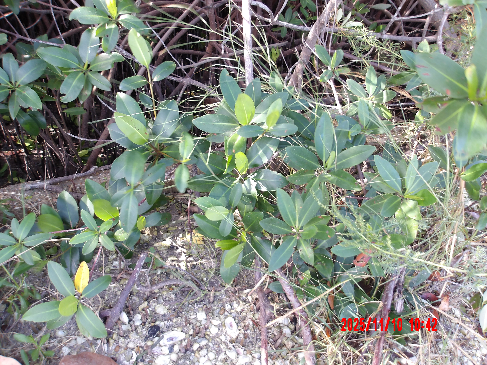

```{r setup, include=FALSE}
knitr::opts_chunk$set(echo = FALSE, message = FALSE, warning = FALSE)

# Set na.rm = TRUE for mean and geomean:
meanNA <- purrr::partial(mean, na.rm = TRUE)
geomNA <- purrr::partial(psych::geometric.mean, na.rm = TRUE)

# Get functions
source('R/funcs.R')
```


Overview
===========================================================

## Column {.tabset .tabset-fade data-width=650}

```{r screen size modal}
# Initialize a reactive value to track if a water quality subtab has been clicked yet:
fc <- reactiveVal(TRUE)

# UI for the initial informational popup:
screen_txt <- modalDialog(
  title = "MOBILE DEVICE DETECTED",
  HTML("<b>PLEASE NOTE:</b>"),
  tags$p(""),
  HTML("It appears you are attempting to view this dashboard using a mobile device.
       This dashboard is still in development and some features may not be displayed 
       properly on a mobile device. For the best experience, please view this dashboard on a
       desktop or tablet computer."),
  easyClose = TRUE,
  footer = modalButton("Close"),
  style = "font-size:90%"
)

# Make sure initial info popup only displayed when the water quality tab is first 
# opened:
observeEvent(input$active_tab, {
  if (input$active_tab == "Overview" & input$screen_width < 800 & fc()){
    showModal(screen_txt)
    fc(FALSE) 
    }
  })
```


<div class = "row">
<div class = "col-md-2"></div>
<div class = "col-md-8">


#### WELCOME TO THE PINELLAS COUNTY WATER QUALITY DASHBOARD!

```{r, echo = FALSE, out.width = '100%', fig.align = 'center', fig.alt='Image of Mangroves'}
knitr::include_graphics('www/welcome.banner.jpg')
```

#### Who We Are and What We Do
The Pinellas County Division of Environmental Management (PCDEM), part of the Pinellas County Public Works Department, is committed to safeguarding environmental health through data collection and application of sound scientific principles. The Division achieves water resource goals by conducting routine water monitoring throughout the county and the surrounding coastal waters. Water samples are collected to determine chemical, physical, and biological elements of streams, lakes, and marine waters within unincorporated Pinellas County and in partnership with various municipalities. Habitat and aquatic species surveys are done at specific times of the year to monitor macroinvertebrates, phytoplankton (including red tide), and benthic and seagrass indicators. Visit our [website](https://pinellas.gov/programs/water-quality-monitoring-program/){target="_blank"} to learn more about our various habitat monitoring programs.

#### Why Water Quality Matters
Water quality is more than just a scientific measure; it's a reflection of the health of our entire ecosystem. Clean water is a home for wildlife and a playground for us – the land and water within the landscape, or watershed, is where we live, work, and play. However, sometimes, water can have too much of certain substances like nutrients, sediment, and bacteria. While nutrients are necessary for aquatic life, in excess, they can be detrimental and lead to overgrowth of algae, resulting in reduced oxygen throughout the waterbody. The process of nutrient enrichment, known as eutrophication, can harm fish and other aquatic organisms as well as block sunlight from reaching aquatic vegetation, including seagrass, and can impair their growth. Healthy seagrass and other aquatic vegetation is important for maintaining healthy levels of dissolved oxygen and providing habitat and food for many marine animal species.

#### Our Success Story – Tampa Bay
Tampa Bay continues to be recognized for water quality and habitat restoration efforts because of collaboration between government entities, academic research, and local stakeholder involvement. Over the last four decades, there has been a concerted effort to improve the bay's water quality through monitoring and adaptive management strategies. Although managing these environmental resources is a continual effort, the success of nutrient reduction in the bay is a testament to what can be achieved through persistent and coordinated environmental management.

#### This Dashboard
This dashboard is designed to make the Division’s (PCDEM) monitoring results accessible and summarize how the lakes, streams, and coastal waters measure up compared to past conditions and based on regulatory and management targets. Click on the "Water Quality" to start exploring the water quality data from sites throughout Pinellas County. 


This dashboard provides several types of data for exploration, including:

1) [__Water Quality__](#water-quality): Water quality data from monitoring sites throughout Pinellas County.
1) [__Red Tide & Beach Bacteria__](#red-tide-beach-bacteria): Current Pinellas County red tide and beach bacteria data.
1) [__Annual Report__](#annual-report): Annual report summarizing water quality and habitat monitoring data
1) [__Data Downloads__](#data-download): Downloadable water quality data.

<br>

The source content for this dashboard can be viewed on [Github](https://github.com/PCDEM/water_quality_dashboard){target="_blank"}.

Technical questions about our water quality data can be sent to [Stacey Day](mailto:sday@pinellas.gov). 
<br>
Questions and comments about the dashboard can be sent to [Alex Manos](mailto:almanos@pinellas.gov).

<br/><br/>

```{r, echo = FALSE, out.width = '60%', fig.align = 'center', fig.alt='County staff collecting data',fig.cap='Pinellas County staff conducting various types of environmental monitoring activities.'}
knitr::include_graphics('www/WN Dashboard Collage.jpg')
```

</div>
<div class = "col-md-2"></div>
</div>

```{r water quality modal}
# Initialize a reactive value to track if a water quality subtab has been clicked yet:
firstClick <- reactiveVal(TRUE)

# UI for the initial informational popup:
txt <- modalDialog(
  title = "NAVIGATING THE WATER QUALITY DATA PAGE",
  HTML("<b>Getting started:</b>"),
  tags$p(""),
  tags$li("Click 'MAP' to view our sampled watersheds."),
  tags$p(""),
  tags$li("Click 'USING THIS TAB' for tab function guidance."),
  tags$p(""),
  tags$li("Click 'BACKGROUND' for general information."),
  br(),
  HTML("<b>Viewing the data:</b>"),
  tags$p(""),
  tags$li("Click any of the colored shapes (watersheds) to view plots and status."),
  tags$p(""),
  tags$li("Click the label at the top of the map for information about the watershed."),
  tags$p(""),
  tags$li("The plots are interactive; use the cursor to highlight data points."),
  tags$p(""),
  tags$li("Click through the tabs to view different water quality parameters."),
  easyClose = TRUE,
  footer = modalButton("Close"),
  style = "font-size:90%"
)

# Make sure initial info popup only displayed when the water quality tab is first 
# opened:
observeEvent(input$active_tab, {
  if (input$active_tab == "Water Quality" & firstClick()){
    showModal(txt)
    firstClick(FALSE) 
    }
  })
```

Coral
===========================================================

## Column {.tabset .tabset-fade data-width="280"}

```{r data for maps, include=FALSE}
library(readxl)
library(dplyr)
library(leaflet)
library(shiny)
#coral
map_data_cr <- read_excel("W:/Watershed/WaterNav/_Water and Navigation (Docks and Dredge-Fill)/Environmental Resource Tracking/Coral/Coral Maps/Coral Map R Files/Coral Locations Tracking.xlsm") %>%
    select(Address, Latitude, Longitude, WND, Species) %>%
    mutate(
      Latitude  = as.numeric(Latitude),
      Longitude = as.numeric(Longitude) # Ensuring both coordinates are numeric
    )

coralIcon <- makeIcon(
    iconUrl    = "https://static.vecteezy.com/system/resources/previews/016/548/438/large_2x/watercolor-sea-coral-png.png",
    iconWidth  = 20, 
    iconHeight = 20
)
#seagrass 
map_data_sg <- read_excel("W:/Watershed/WaterNav/_Water and Navigation (Docks and Dredge-Fill)/Environmental Resource Tracking/Seagrass/Seagrass Maps/Seagrass R Files/Seagrass Locations Tracking.xlsm") %>%
    select(Address, Latitude, Longitude, WND, Species) %>%
    mutate(
      Latitude  = as.numeric(Latitude),
      Longitude = as.numeric(Longitude) # Ensuring both coordinates are numeric
    )

seagrassIcon <- makeIcon(
    iconUrl    = "https://png.pngtree.com/png-vector/20220813/ourmid/pngtree-green-seaweed-clipart-design-png-image_6109503.png",
    iconWidth  = 20, 
    iconHeight = 20
)
#mangroves
map_data_mg <- read_excel("W:/Watershed/WaterNav/_Water and Navigation (Docks and Dredge-Fill)/Environmental Resource Tracking/Mangroves/Mangrove Maps/Mangrove R Files/Mangrove Locations Tracking.xlsm") %>%
    select(Address, Latitude, Longitude, WND, Species) %>%
    mutate(
      Latitude  = as.numeric(Latitude),
      Longitude = as.numeric(Longitude) # Ensuring both coordinates are numeric
    )

mangroveIcon <- makeIcon(
    iconUrl    = "https://png.pngtree.com/png-vector/20221210/ourmid/pngtree-mangrove-tree-with-the-strong-roots-png-image_6518985.png",
    iconWidth  = 20, 
    iconHeight = 20
)
```

```{r coral map, fig.width=10, fig.height=10, echo=FALSE, message=FALSE, warning=FALSE}
# Create and display the map directly in the Rmd document
leaflet(data = map_data_cr, options = leafletOptions(
    zoomControl = TRUE, 
    zoomSnap    = 0.1, 
    zoomDelta   = 0.5
  )) %>%
  addTiles(attribution = '') %>%
  addProviderTiles(providers$Esri.WorldImagery, group = 'Esri.WorldImagery') %>%
  addMarkers(
    lng    = ~Longitude, 
    lat    = ~Latitude, 
    icon   = coralIcon,
    popup  = ~paste0("<b>", WND, "</b><br>", Species)
  ) %>%
  setView(
    lng  = -82.72, 
    lat  = 27.905, 
    zoom = 10.5
  )
```

## Column {.tabset .tabset-fade data-width="145"}

### Coral
Coral is important what have you whole speel

### Gallery
```{r coral-carousel-html, echo=FALSE}
shiny::HTML('
<div id="coralCarousel" class="carousel slide" data-ride="carousel" style="max-width: 750px; margin: 0 auto; background-color: #f8f9fa; border-radius: 8px; padding: 15px; box-shadow: 0 4px 6px rgba(0,0,0,0.1);">
  
  <h4 style="margin-top:0; color: #00244c; font-weight:600; text-align: center;">Coral Gallery</h4>
  
  <!-- Carousel Images Wrapper -->
  <div class="carousel-inner" style="border-radius: 6px; overflow: hidden;">
    
    <div class="item active">
      
      <div class="carousel-caption" style="background: rgba(0, 36, 76, 0.7); right: 0; left: 0; bottom: 0; padding: 10px;">
        <p style="margin:0; color:white; font-size:16px;">Tube Coral-<em>Syringodium filiformae</em></p>
      </div>
    </div>

    <div class="item">
      
      <div class="carousel-caption" style="background: rgba(0, 36, 76, 0.7); right: 0; left: 0; bottom: 0; padding: 10px;">
        <p style="margin:0; color:white; font-size:16px;">Colorful Seawhip-Leptogorgia virgulata</p>
      </div>
    </div>

    <div class="item">
      
      <div class="carousel-caption" style="background: rgba(0, 36, 76, 0.7); right: 0; left: 0; bottom: 0; padding: 10px;">
        <p style="margin:0; color:white; font-size:16px;">Smooth Star Coral-Solenastrea bournoni</p>
      </div>
    </div>

    <div class="item">
      
      <div class="carousel-caption" style="background: rgba(0, 36, 76, 0.7); right: 0; left: 0; bottom: 0; padding: 10px;">
        <p style="margin:0; color:white; font-size:16px;">Ivory Tree Coral-Oculina varicosa</p>
      </div>
    </div>

    <div class="item">
      
      <div class="carousel-caption" style="background: rgba(0, 36, 76, 0.7); right: 0; left: 0; bottom: 0; padding: 10px;">
        <p style="margin:0; color:white; font-size:16px;">Hidden Cup Coral-Phyllangia americana</p>
      </div>
    </div>

    <div class="item">
      
      <div class="carousel-caption" style="background: rgba(0, 36, 76, 0.7); right: 0; left: 0; bottom: 0; padding: 10px;">
        <p style="margin:0; color:white; font-size:16px;">Knobby Star Coral-Solenastrea hyades</p>
      </div>
    </div>

  </div>

  <!-- Clickable Left & Right Navigation Controls -->
  <a class="left carousel-control" href="#coralCarousel" data-slide="prev" style="background-image:none; color:#00244c;">
    <span class="glyphicon glyphicon-chevron-left" style="position:absolute; top:50%; transform:translateY(-50%);"></span>
  </a>
  <a class="right carousel-control" href="#coralCarousel" data-slide="next" style="background-image:none; color:#00244c;">
    <span class="glyphicon glyphicon-chevron-right" style="position:absolute; top:50%; transform:translateY(-50%);"></span>
  </a>

</div>
')
```

### Permitting criteria
permitting what we do and why we require it with the state

[webpage](https://floridadep.gov/DEAR/Water-Quality-Standards){target="_blank"} for more information about specific water quality criteria throughout the state of Florida.


Seagrass
===========================================================
## Column {.tabset .tabset-fade data-width="280"}

```{r seagrass map, echo=FALSE, message=FALSE, warning=FALSE}
  
  leaflet(data = map_data_sg, options = leafletOptions(
    zoomControl = TRUE, 
    zoomSnap    = 0.1, 
    zoomDelta   = 0.5
  )) %>%
  addTiles(attribution = '') %>%
  addProviderTiles(providers$Esri.WorldImagery, group = 'Esri.WorldImagery') %>%
  addMarkers(
    lng    = ~Longitude, 
    lat    = ~Latitude, 
    icon   = seagrassIcon,
    popup  = ~paste0("<b>", WND, "</b><br>", Species)
  ) %>%
  setView(
    lng  = -82.72, 
    lat  = 27.905, 
    zoom = 9
  )
```


## Column {.tabset .tabset-fade data-width="180"}
### Seagrass
Speel

### Gallery
```{r seagrass-carousel, echo=FALSE}
tabPanel(
  "Seagrass",
  br(),
  shiny::HTML('
  <div id="seagrassCarousel" class="carousel slide" data-ride="carousel" style="max-width: 750px; margin: 0 auto; background-color: #f8f9fa; border-radius: 8px; padding: 15px; box-shadow: 0 4px 6px rgba(0,0,0,0.1);">
    
    <h4 style="margin-top:0; color: #00244c; font-weight:600; text-align: center;">Seagrass Gallery</h4>
    
    <!-- Carousel Images Wrapper -->
    <div class="carousel-inner" style="border-radius: 6px; overflow: hidden;">
      
      <div class="item active">
        
        <div class="carousel-caption" style="background: rgba(0, 36, 76, 0.7); right: 0; left: 0; bottom: 0; padding: 10px;">
          <p style="margin:0; color:white; font-size:16px;">Manatee Grass-<em>Syringodium filiformae</em></p>
        </div>
      </div>

      <div class="item">
        
        <div class="carousel-caption" style="background: rgba(0, 36, 76, 0.7); right: 0; left: 0; bottom: 0; padding: 10px;">
          <p style="margin:0; color:white; font-size:16px;">Manatee Grass-<em>Syringodium filiformae</em></p>
        </div>
      </div>

      <div class="item">
        
        <div class="carousel-caption" style="background: rgba(0, 36, 76, 0.7); right: 0; left: 0; bottom: 0; padding: 10px;">
          <p style="margin:0; color:white; font-size:16px;">Manatee Grass-<em>Syringodium filiformae</em></p>
        </div>
      </div>

      <div class="item">
        
        <div class="carousel-caption" style="background: rgba(0, 36, 76, 0.7); right: 0; left: 0; bottom: 0; padding: 10px;">
          <p style="margin:0; color:white; font-size:16px;">Manatee Grass-<em>Syringodium filiformae</em></p>
        </div>
      </div>

    </div>

    <!-- Clickable Left & Right Navigation Controls -->
    <a class="left carousel-control" href="#seagrassCarousel" data-slide="prev" style="background-image:none; color:#00244c;">
      <span class="glyphicon glyphicon-chevron-left" style="position:absolute; top:50%; transform:translateY(-50%);"></span>
    </a>
    <a class="right carousel-control" href="#seagrassCarousel" data-slide="next" style="background-image:none; color:#00244c;">
      <span class="glyphicon glyphicon-chevron-right" style="position:absolute; top:50%; transform:translateY(-50%);"></span>
    </a>

  </div>
  ')
)
```

### Guidelines for permitting
permitting what we do and why we require it with the state

[webpage](https://floridadep.gov/DEAR/Water-Quality-Standards){target="_blank"} for more information about specific water quality criteria throughout the state of Florida.

Mangroves
===========================================================

## Column {.tabset .tabset-fade data-width="280"}

```{r mangrove map, echo=FALSE, message=FALSE, warning=FALSE}
# Create and display the map directly in the Rmd document
leaflet(data = map_data_mg, options = leafletOptions(
    zoomControl = TRUE, 
    zoomSnap    = 0.1, 
    zoomDelta   = 0.5
  )) %>%
  addTiles(attribution = '') %>%
  addProviderTiles(providers$Esri.WorldImagery, group = 'Esri.WorldImagery') %>%
  addMarkers(
    lng    = ~Longitude, 
    lat    = ~Latitude, 
    icon   = mangroveIcon,
    popup  = ~paste0("<b>", WND, "</b><br>", Species)
  ) %>%
  setView(
    lng  = -82.72, 
    lat  = 27.905, 
    zoom = 9
  )
```


## Column {.tabset .tabset-fade data-width="180"}

### Mangroves
Importannce

### Gallery
```{r mangroves-carousel, echo=FALSE}
tabPanel(
  "Mangroves",
  br(),
  fluidRow(
    column(
      width = 12,
      shiny::HTML('
      <div id="mangroveCarousel" class="carousel slide" data-ride="carousel" style="max-width: 750px; margin: 0 auto; background-color: #f8f9fa; border-radius: 8px; padding: 15px; box-shadow: 0 4px 6px rgba(0,0,0,0.1);">
        
        <h4 style="margin-top:0; color: #00244c; font-weight:600; text-align: center;">Mangrove Gallery</h4>
        
        <!-- Carousel Images Wrapper -->
        <div class="carousel-inner" style="border-radius: 6px; overflow: hidden;">
          
          <div class="item active">
            
            <div class="carousel-caption" style="background: rgba(0, 36, 76, 0.7); right: 0; left: 0; bottom: 0; padding: 10px;">
              <p style="margin:0; color:white; font-size:16px;">Red Mangrove Prop Roots</p>
            </div>
          </div>

          <div class="item">
            
            <div class="carousel-caption" style="background: rgba(0, 36, 76, 0.7); right: 0; left: 0; bottom: 0; padding: 10px;">
              <p style="margin:0; color:white; font-size:16px;">White Mangrove</p>
            </div>
          </div>

          <div class="item">
            
            <div class="carousel-caption" style="background: rgba(0, 36, 76, 0.7); right: 0; left: 0; bottom: 0; padding: 10px;">
              <p style="margin:0; color:white; font-size:16px;">Black Mangrove</p>
            </div>
          </div>

        </div>

        <!-- Clickable Left & Right Navigation Controls -->
        <a class="left carousel-control" href="#mangroveCarousel" data-slide="prev" style="background-image:none; color:#00244c;">
          <span class="glyphicon glyphicon-chevron-left" style="position:absolute; top:50%; transform:translateY(-50%);"></span>
        </a>
        <a class="right carousel-control" href="#mangroveCarousel" data-slide="next" style="background-image:none; color:#00244c;">
          <span class="glyphicon glyphicon-chevron-right" style="position:absolute; top:50%; transform:translateY(-50%);"></span>
        </a>

      </div>
      ')
    )
  )
)
```

### Permitting things
permitting what we do and why we require it with the state

[webpage](https://floridadep.gov/DEAR/Water-Quality-Standards){target="_blank"} for more information about specific water quality criteria throughout the state of Florida.


Contact us
===========================================================

Contact us! list emaiails links and other things


